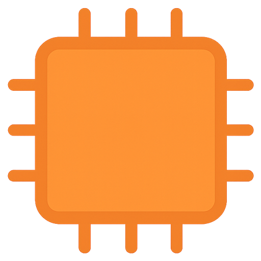

# PinViz

<p align="center">
  
</p>

<p align="center">
  <a href="https://github.com/nordstad/PinViz/actions/workflows/ci.yml"></a>
  <a href="https://nordstad.github.io/PinViz/"></a>
  <a href="https://opensource.org/licenses/MIT"></a>
  <a href="https://www.python.org/downloads/"></a>
  <a href="https://pypi.org/project/pinviz/"></a>
  <a href="https://pepy.tech/projects/pinviz"></a>
</p>

Programmatically generate beautiful Raspberry Pi GPIO connection diagrams in SVG format.

PinViz makes it easy to create clear, professional wiring diagrams for your Raspberry Pi projects. Define your connections using simple YAML/JSON files or Python code, and automatically generate publication-ready SVG diagrams.

## Features

- **Declarative Configuration**: Define diagrams using YAML or JSON
- **Programmatic API**: Create diagrams with Python code
- **Automatic Wire Routing**: Smart wire routing with configurable styles (orthogonal, curved, mixed)
- **Inline Components**: Add resistors, capacitors, and diodes directly on wires
- **Color-Coded Wires**: Automatic color assignment based on pin function (I2C, SPI, power, ground, etc.)
- **Built-in Templates**: Pre-configured boards (Raspberry Pi 5) and common devices (BH1750, IR LED rings, etc.)
- **GPIO Pin Reference**: Optional GPIO pinout diagram for easy reference
- **SVG Output**: Scalable, high-quality vector graphics

## Example Diagrams

### LED with Resistor

Simple LED circuit with inline current-limiting resistor:


### Multi-Device Setup

BH1750 light sensor + IR LED ring with custom wire colors:


### Traffic Light

Three LEDs with individual resistors:


## Quick Start

### Installation

Using `uv` (recommended):

```bash
uv add pinviz
```

Using `pip`:

```bash
pip install pinviz
```

### Your First Diagram

Create a configuration file `my-diagram.yaml`:

```yaml
title: "BH1750 Light Sensor Wiring"
board: "raspberry_pi_5"

devices:
  - type: "bh1750"
    name: "BH1750"

connections:
  - board_pin: 1     # 3V3
    device: "BH1750"
    device_pin: "VCC"

  - board_pin: 6     # GND
    device: "BH1750"
    device_pin: "GND"

  - board_pin: 5     # GPIO3 (I2C SCL)
    device: "BH1750"
    device_pin: "SCL"

  - board_pin: 3     # GPIO2 (I2C SDA)
    device: "BH1750"
    device_pin: "SDA"
```

Generate the diagram:

```bash
pinviz my-diagram.yaml -o output.svg
```

## Next Steps

- [Installation Guide](getting-started/installation.md) - Detailed installation instructions
- [Quick Start Tutorial](getting-started/quickstart.md) - Step-by-step guide
- [CLI Usage](guide/cli.md) - Command-line interface reference
- [Python API](guide/python-api.md) - Programmatic usage
- [API Reference](api/index.md) - Complete API documentation

## License

MIT License - See [LICENSE](https://github.com/nordstad/PinViz/blob/main/LICENSE) for details.

## Contributing

Contributions are welcome! See our [Contributing Guide](development/contributing.md) for details.
